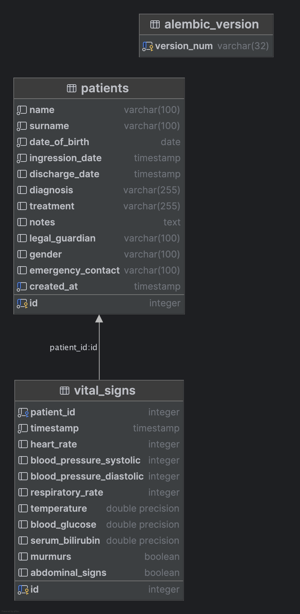

# Smart Monitoring System for Neonatal Vital Signs

## 📌 Overview

This project aims to design and implement a smart real-time monitoring system for **neonatal vital signs**, using
biometric sensors to measure **body temperature,** **heart rate** and some other relevants measures. The solution is
focused on neonatal intensive care units (NICUs), enhancing early detection of critical conditions by continuously
analyzing sensor data and generating alerts when vital signs go out of safe thresholds.

---

## 🛠️ Installation

### Development Environment Setup

1. Install poetry dependencies:
   ```bash
   poetry install
   ```
2. Activate the virtual environment:
   ```bash
    poetry shell
    ```
3. Install pre-commit hooks:
   ```bash
   pre-commit install
   ```
4. Run tests to ensure everything is set up correctly:
   ```bash
    pytest
    ```
5. Start the development server:
   ```bash
   uvicorn app.main:app --reload
   ```

---

## 📖 Research

| Condition                                                      | Vital signs monitored                                           | Main treatments / measures                                                                              | References                                                                                                                                                                                                                                                                                                                    |
|----------------------------------------------------------------|-----------------------------------------------------------------|---------------------------------------------------------------------------------------------------------|-------------------------------------------------------------------------------------------------------------------------------------------------------------------------------------------------------------------------------------------------------------------------------------------------------------------------------|
| **Respiratory Distress Syndrome (RDS)**                        | Respiratory rate, oxygen saturation, heart rate, blood pressure | Ventilatory support (CPAP, mechanical ventilation), exogenous surfactant, thermal control               | [(Baseer et al., 2020)](https://consensus.app/papers/risk-factors-of-respiratory-diseases-among-neonates-in-baseer-mohamed/c5f857a3c728536d8ede20200580d560), [(Cvetnic & Sills, 1992)](https://consensus.app/papers/8-neonatal-lung-disease-cvetnic-sills/fe270b6c97eb535bb9b28d19d195c64a/)                                 |
| **Transient Tachypnea of the Newborn (TTN)**                   | RR, O₂ saturation, BP                                           | Oxygen therapy, nasal CPAP, fluid restriction                                                           | [(Baseer et al., 2020)](https://consensus.app/papers/risk-factors-of-respiratory-diseases-among-neonates-in-baseer-mohamed/c5f857a3c728536d8ede20200580d560)                                                                                                                                                                  |
| **Neonatal Pneumonia**                                         | RR, temperature, O₂, BP                                         | Antibiotics, ventilatory support, IV fluids                                                             | [(Baseer et al., 2020)](https://consensus.app/papers/risk-factors-of-respiratory-diseases-among-neonates-in-baseer-mohamed/c5f857a3c728536d8ede20200580d560), [(Shrestha, 2020)](https://consensus.app/papers/neonatal-admission-from-emergency-department-shrestha/4f8d1a3ac4b15ce7a97cdde81d5b7fe3/)                        |
| **Meconium Aspiration Syndrome (MAS)**                         | RR, O₂ saturation, HR, BP                                       | Suction, oxygen therapy, CPAP or mechanical ventilation, surfactant, antibiotics if infection suspected | [(Baseer et al., 2020)](https://consensus.app/papers/risk-factors-of-respiratory-diseases-among-neonates-in-baseer-mohamed/c5f857a3c728536d8ede20200580d560)                                                                                                                                                                  |
| **Neonatal Sepsis**                                            | HR, temperature, BP, O₂ saturation                              | Blood cultures, antibiotics (ampicillin + gentamicin), hemodynamic support, IV fluids                   | [(Khashana, 2016)](https://consensus.app/papers/microbes-causing-severe-neonatal-septicemia-in-a-tertiary-khashana/5f3b10bb9d655063a2411d64b63b32ae), [(Memon et al., 2023)](https://consensus.app/papers/outcomes-and-frequency-of-neonatal-diseases-observed-in-memon-kazi/a3f84ca1a3da5eb69f54396d3c2c8f3f/)               |
| **Perinatal Asphyxia / Hypoxic-Ischemic Encephalopathy (HIE)** | HR, BP, O₂, temperature, EEG                                    | Neonatal resuscitation, ventilation, therapeutic hypothermia, anticonvulsants, IV fluids                | [(Rahman et al., 2024)](https://consensus.app/papers/reason-for-admission-and-neonatal-outcome-in-the-neonatal-rahman-begum/835265b75b8b54fab57fb04616f0b141/)                                                                                                                                                                |
| **Prematurity & Low Birth Weight**                             | HR, RR, BP, O₂, glucose                                         | Incubator, parenteral/enteral nutrition, infection prevention, caffeine for apnea, antenatal steroids   | [(Mobeen et al., 2024)](https://consensus.app/papers/spectrum-of-disease-and-outcome-in-neonates-admitted-in-mobeen-ashraf/85e7df579b995a97801c4bf1843766f5), [(Memon et al., 2023)](https://consensus.app/papers/outcomes-and-frequency-of-neonatal-diseases-observed-in-memon-kazi/a3f84ca1a3da5eb69f54396d3c2c8f3f/)       |
| **Neonatal Jaundice**                                          | Serum bilirubin, HR, temperature                                | Phototherapy, exchange transfusion in severe cases                                                      | [(Xie et al., 2022)](https://consensus.app/papers/the-disease-spectrum-and-influencing-factors-of-nicu-in-xie-zhu/52d025ebcbc05b87be547dfdebfe9cf2/)                                                                                                                                                                          |
| **Congenital Heart Disease (ASD, VSD, PDA, TGA, TOF)**         | O₂ saturation, BP, HR, murmurs                                  | Echocardiography, prostaglandin E1 to keep ductus open, corrective surgery                              | [(Şimşek & Baysal, 2019)](https://consensus.app/papers/incidence-and-distribution-of-congenital-heart-disease-in-şimşek-baysal/6e0ffc22f4f85a119f4fbfe51fd98e88), [(Korkmaz et al., 2015)](https://consensus.app/papers/incidence-and-clinical-characteristics-of-congenital-korkmaz-özkan/1e06799d3b895bd6b05260b449bd59dd/) |
| **Necrotizing Enterocolitis (NEC)**                            | HR, temperature, O₂, BP, abdominal signs                        | Stop oral feeds, antibiotics, parenteral nutrition, surgery if severe                                   | [(Gheorghe & Bhandari, 2015)](https://consensus.app/papers/stem-cell-therapy-in-neonatal-diseases-gheorghe-bhandari/ab59785634e657ddaec27feefd3cda47/)                                                                                                                                                                        |

### Standard NICU Measurements and Units
| Parameter / Vital Sign         | Unit of Measurement                                               | Normal Reference Range (Term Neonates)                                |
| ------------------------------ | ----------------------------------------------------------------- | --------------------------------------------------------------------- |
| **Heart Rate (HR)**            | Beats per minute (bpm)                                            | 100–180 bpm                                                           |
| **Respiratory Rate (RR)**      | Breaths per minute (breaths/min)                                  | 30–60 breaths/min                                                     |
| **Oxygen Saturation (SpO₂)**   | Percentage (%)                                                    | 90–95% (varies with gestational age and condition)                    |
| **Blood Pressure (BP)**        | Millimeters of mercury (mmHg)                                     | Systolic: 60–80 mmHg, Diastolic: 40–50 mmHg                           |
| **Temperature**                | Degrees Celsius (°C) or Fahrenheit (°F)                           | 36.5–37.5 °C (97.7–99.5 °F)                                           |
| **Blood Glucose**              | Milligrams per deciliter (mg/dL) or Millimoles per liter (mmol/L) | 45–125 mg/dL (2.5–7 mmol/L)                                           |
| **Serum Bilirubin**            | mg/dL or Micromoles per liter (µmol/L)                            | < 5 mg/dL at birth; treatment if > 15 mg/dL depending on age in hours |
| **Arterial Blood Gases (ABG)** | pH (unitless), PaO₂ (mmHg), PaCO₂ (mmHg), HCO₃⁻ (mEq/L)           | pH: 7.25–7.35; PaO₂: 50–70 mmHg; PaCO₂: 35–45 mmHg                    |
| **Weight**                     | Grams (g) or Kilograms (kg)                                       | Normal: \~2500–4000 g                                                 |
| **Urine Output**               | Milliliters per kilogram per hour (mL/kg/h)                       | > 1 mL/kg/h                                                           |
| **Head Circumference**         | Centimeters (cm)                                                  | 32–36 cm                                                              |
| **Length**                     | Centimeters (cm)                                                  | 48–53 cm                                                              |

---

## 🌐 Use Cases

- Neonatal Intensive Care Units (NICU)
- Remote monitoring in rural hospitals
- Home monitoring for early-discharged infants

---

## Diagrams

### 🏗️ System Architecture


### 💽 Database Diagram



---

## 🚀 Future Extensions

- Predictive models for sepsis or apnea detection
- Integration with respiratory rate sensors
- Mobile app for caregivers and medical personnel
